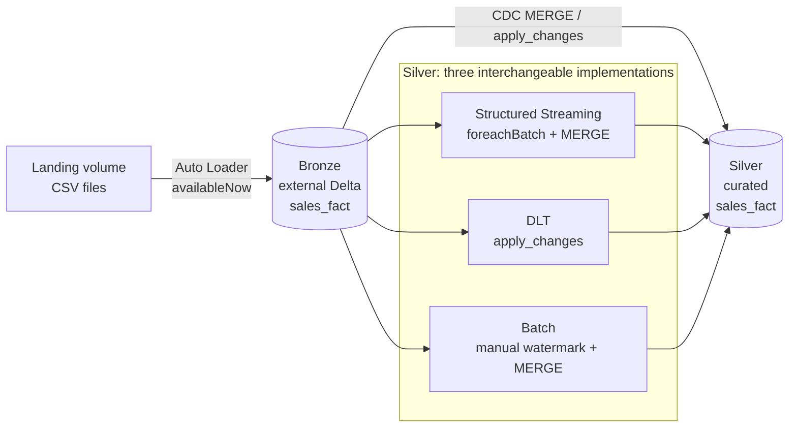

# albert-databricks

A small but complete **Azure Databricks lakehouse** project that ingests a sales
transaction feed and applies **change data capture (CDC)** into a curated silver
table. It is packaged as a **Databricks Asset Bundle** with dev/prod targets and
demonstrates **three interchangeable ways** to build the same silver layer, so
the trade-offs between them can be discussed side by side.

---

## What this project demonstrates

- **Medallion architecture** (landing → bronze → silver) on Unity Catalog.
- **Incremental ingestion** with Auto Loader (`cloudFiles`) and `Trigger.AvailableNow`.
- **CDC upserts** (`INSERT` / `UPDATE` / `DELETE`) into Delta via `MERGE`.
- **Three implementations of the same silver transform**, each with a different
  incremental-state strategy: Structured Streaming, Delta Live Tables (DLT), and
  a plain batch job with a self-managed watermark.
- **Testable, shared business logic** extracted into a pure module with `pytest`.
- **Infrastructure as code**: jobs, pipelines, and clusters defined declaratively
  in a Databricks Asset Bundle and deployable from CI.

---

## Architecture



The **bronze** table is an append-only landing zone: every row of the source
feed (including `INSERT`/`UPDATE`/`DELETE` change records) is stored as-is, plus
two ingestion-metadata columns (`_INGESTION_TIME`, `_SOURCE_FILE`).

The **silver** table is the curated, deduplicated current-state view: the CDC
operations are collapsed to the latest change per key and merged in, so a `D`
removes the row, a `U` overwrites it, and an `I` inserts it.

---

## CDC / data model

Source rows carry an `OPERATION_TYPE` column (`I`, `U`, `D`). Key facts:

- **Merge key**: `slip_seq_id`.
- **Sequence column**: `creation_date` — used both to pick the latest change per
  key within a batch and as an out-of-order guard (`s.creation_date >= t.creation_date`)
  so a stale update can never overwrite a newer row.
- **Deletes** are applied as physical deletes (SCD type 1 semantics — current
  state only, no history).

The sample data lives in `data/` (`transactions.csv` = initial load,
`transactions_changes.csv` = a follow-up CDC batch), generated from the source
Excel workbook via `local/xlsx_to_csv.py`.

---

## The three silver implementations

All three produce an equivalent curated silver table; they differ only in how
they track "what have I already processed?".

| Aspect | Structured Streaming | Delta Live Tables (DLT) | Batch + watermark |
|---|---|---|---|
| File | `sales_fact_silver.py` | `sales_fact_silver_dlt.py` | `sales_fact_silver_batch.py` |
| Incremental state | Spark **checkpoint** | Engine-managed | **Manual** Delta control table |
| CDC apply | `foreachBatch` + `MERGE` | `dlt.apply_changes` | batch snapshot filter + `MERGE` |
| Dedup / ordering | shared `dedup_latest_changes` | `sequence_by` | shared `dedup_latest_changes` |
| Data quality | (in code) | `expect_all_or_drop` | (in code) |
| Infra | job (`schedule`) | pipeline + trigger job | job (`schedule`) |
| Best when | full control, custom logic | least code, managed ops | no streaming runtime, explicit control |

### 1. Structured Streaming — `sales_fact_silver.py`
Reads the bronze table as a stream and, in `foreachBatch`, deduplicates the
microbatch and runs a Delta `MERGE`. Exactly-once incremental processing is
provided by the Spark **checkpoint**. Runs on a schedule with
`Trigger.AvailableNow` (process everything new, then stop).

### 2. Delta Live Tables — `sales_fact_silver_dlt.py`
The declarative equivalent. A `@dlt.view` casts bronze into the curated schema
contract, `dlt.create_streaming_table` declares the target (with liquid
clustering, auto-optimize, and a DLT **expectation** on the key), and
`dlt.apply_changes` handles the CDC — `keys`, `sequence_by`, and
`apply_as_deletes` replace the hand-written dedup + `MERGE`. The DLT runtime owns
the checkpoint, target creation, and incremental state. Configured entirely from
the pipeline `configuration` block and triggered by a job when bronze updates.

### 3. Batch with a self-managed watermark — `sales_fact_silver_batch.py`
No streaming runtime at all. The job:
1. reads the last processed watermark from a small Delta control table
   (`cdc_watermarks`),
2. reads bronze as a **batch snapshot**, keeping only rows newer than the
   watermark (using `_INGESTION_TIME`),
3. deduplicates and `MERGE`s the changes into silver,
4. advances the watermark **only after** a successful merge.

Because the `MERGE` is idempotent, advancing the watermark last gives safe
at-least-once semantics: a crash between the merge and the watermark write simply
reprocesses the same changes harmlessly next run.

### Shared logic — `silver_cdc.py`
`dedup_latest_changes()` collapses a CDC batch to a single latest row per key
(`row_number` over a key-partitioned, sequence-ordered window). It is kept pure
(no I/O, no Spark session setup) so it can be unit tested locally and reused by
both the streaming and batch jobs.

---

## Ingestion — `src/ingestion/ingest.py`

- Creates the bronze **external** Delta table if it doesn't exist.
- Uses **Auto Loader** (`cloudFiles`, CSV, `inferColumnTypes`, schema location on
  the checkpoint) to incrementally pick up new files from the landing volume.
- Adds `_INGESTION_TIME` and `_SOURCE_FILE` metadata columns.
- Writes with `mergeSchema` and `Trigger.AvailableNow`.
- The job (`sales_fact_ingestion`) is triggered by **file arrival** on the
  landing volume.

---

## Repository layout

```
albert-databricks/
├── databricks.yaml                 # Asset Bundle: name, includes, dev/prod targets, variables
├── resources/
│   ├── clusters/                   # reusable job-cluster definitions
│   ├── jobs/                       # ingestion + 3 silver jobs (+ DLT trigger job)
│   └── pipelines/                  # DLT pipeline definition
├── src/
│   ├── ingestion/ingest.py         # bronze: Auto Loader → external Delta
│   └── transforms/
│       ├── sales_fact_silver.py        # silver #1: structured streaming
│       ├── sales_fact_silver_dlt.py    # silver #2: DLT apply_changes
│       ├── sales_fact_silver_batch.py  # silver #3: batch + watermark
│       └── silver_cdc.py               # shared, unit-tested dedup helper
├── tests/                          # pytest + local SparkSession fixture
├── data/                           # sample CSVs (initial load + change batch)
├── local/xlsx_to_csv.py            # helper to regenerate CSVs from the workbook
└── pyproject.toml                  # deps + pytest config (uv-managed)
```

---

## Deployment (Databricks Asset Bundles)

Everything is deployed as a single bundle. `databricks.yaml` defines two targets:

- `dev` (default, `mode: development`) — resources are prefixed/tagged per user.
- `prod` (`mode: production`).

Catalog names, storage account, and tags are driven by the `env` and
`storage_account` **bundle variables**, so the same code deploys to
`dev_bronze` / `dev_silver` or `prod_bronze` / `prod_silver` without edits.

```bash
# Validate the bundle
databricks bundle validate -t dev

# Deploy jobs, pipeline, and clusters
databricks bundle deploy -t dev

# Run a specific job
databricks bundle run -t dev Ingestion
databricks bundle run -t dev SalesFactSilverBatch
```

---

## Local development

The project uses [`uv`](https://docs.astral.sh/uv/) for dependency management.
The pure transform logic is tested against a **local SparkSession** (no Delta,
Hive, or cluster required — just a JVM and `pyspark`).

```bash
# Install dev dependencies (pyspark, pytest, pandas, openpyxl)
uv sync

# Run the unit tests for the shared CDC logic
uv run pytest

# Regenerate the sample CSVs from the Excel workbook
uv run python local/xlsx_to_csv.py
```

`tests/test_silver_cdc.py` uses parametrized cases to verify
`dedup_latest_changes` — latest-change-wins, delete-wins, multi-key collapse,
pass-through of already-unique keys, empty input, and schema preservation.

---

## Design highlights (talking points)

- **One source of truth for business logic.** The dedup rule lives in one pure,
  tested function shared across implementations, instead of being copy-pasted
  into each job.
- **Idempotent, restart-safe writes.** Keyed `MERGE` + sequence guard means
  reprocessing the same batch is a no-op, which is what makes the manual-watermark
  approach safe under at-least-once delivery.
- **Same outcome, three operational models.** The project makes the streaming vs.
  DLT vs. batch trade-off concrete: checkpoint-managed vs. engine-managed vs.
  self-managed incremental state.
- **Config-driven, not hard-coded.** Catalogs, storage, and table names come from
  job parameters / pipeline configuration and bundle variables, so nothing is
  environment-specific in the code.
